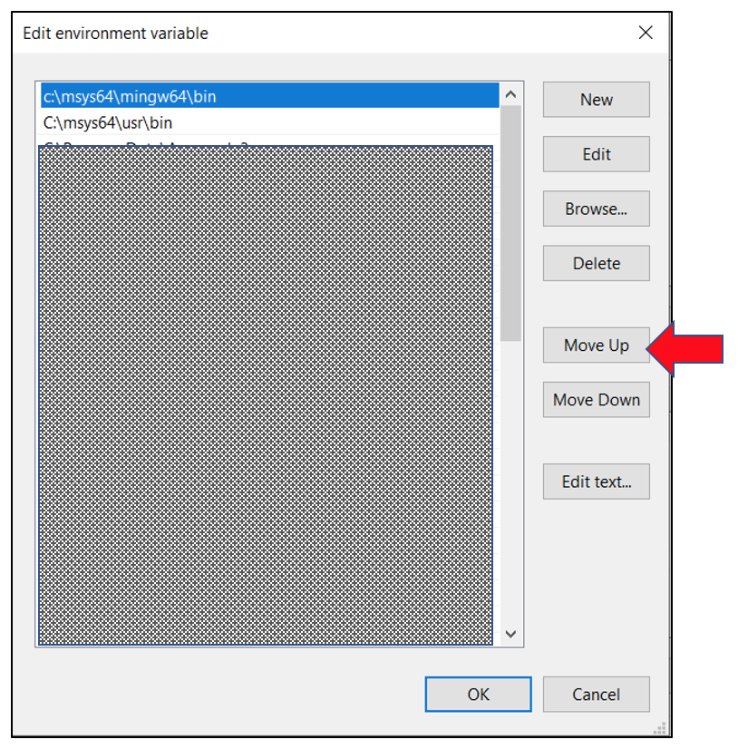
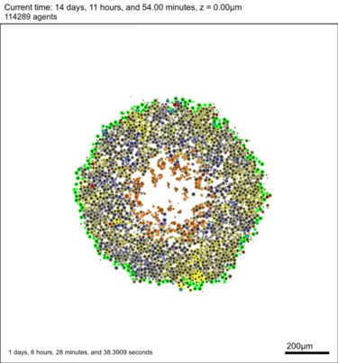
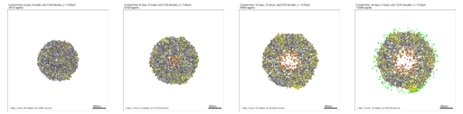
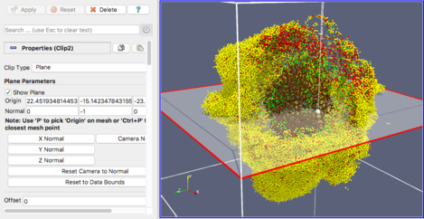

# Quickstart Guide to PhysiCell 

   * [Download](#download)
   * [Build: the basics](#build-the-basics)
      * [Windows](#windows)
      * [macOS](#macos)
      * [Linux](#linux)
   * [Python](#python)
   * [Build: sample projects](#build-sample-projects)
   * [Visualizing Output](#visualizing-output)
      * [Browser](#browser)
      * [MATLAB/Octave](#matlaboctave)
      * [Matplotlib](#matplotlib)
      * [ImageMagick](#imagemagick)
      * [ParaView](#paraview)
   * [Support](#support)
   * [References](#references)

## Download

We currently provide 2 options for downloading the PhysiCell source code:

* https://sourceforge.net/projects/physicell/

* https://github.com/MathCancer/PhysiCell/releases

For more detailed information, see Section 3 of the User Guide (in `/documentation`)
and/or also http://www.mathcancer.org/blog/physicell-tutorials/.

<hr> <!---------------------------------------------->

## Build: the basics

PhysiCell is written in C++ and should build on any of the three major operating systems: Windows, macOS, and Linux. 
The one <b>requirement is that your compiler support OpenMP</b>. If, during your build (make) process, you get
a message like: `error: unsupported option '-fopenmp'`, you'll know your Makefile is trying to use a compiler
that doesn't support OpenMP. You may need to install an OpenMP-supported compiler and/or edit the Makefile to use it.

### Windows

The currently preferred way to use PhysiCell on Windows is to install MinGW64,
a minimal version of GCC that supports OpenMP (on a 64-bit computer). 

1) From [msys2.org](https://www.msys2.org), follow steps 1-4 (stopping before step 5). Click through the setup dialog, accepting the default suggestions.

2) In the MSYS2 console terminal, copy/paste/execute the following command (a package manager to install MINGW64 and additional libraries):
```
$ pacman -S mingw-w64-x86_64-binutils mingw-w64-x86_64-gcc mingw-w64-x86_64-headers-git  mingw-w64-x86_64-gcc-libs mingw-w64-x86_64-libwinpthread-git mingw-w64-x86_64-winpthreads-git mingw-w64-x86_64-lapack mingw-w64-x86_64-openblas mingw-w64-x86_64-libxml2 mingw-w64-x86_64-bzip2 git make
```

3) After the above completes, open the Windows application to let you edit your Environment Variables. You have the option of editing the “User variables” or “System variables”. If it is just for your use and not intended to be shared by other users on this computer, then you can just edit “User variables”. Edit the “Path” variable and add two “New” paths:
```
C:\msys64\mingw64\bin
C:\msys64\usr\bin
```

4) Using the same application as above, `Move up` each of the two new paths to be at the very top.



Then click `OK` on each Edit env variable window to complete the PATH update.

5) Open a *new* Powershell (or Command Prompt) window and type `g++ --version` to verify it can be found:
```
PS C:\Users\heiland> g++ --version
g++.exe (Rev10, Built by MSYS2 project) 10.2.0
Copyright (C) 2020 Free Software Foundation, Inc.
```


### macOS

Unfortunately, the C++ compiler provided by the latest version of XCode on macOS does not support OpenMP.
To resolve this, we recommend using the `brew` package manager to install a recent version of `gcc`. Follow the [brew 
installation instructions](https://docs.brew.sh/Installation.html).

After installing brew, type `brew install gcc` from a Terminal command line. This 
should install a recent version of gcc/g++ (supporting OpenMP) into `/usr/local/bin`. 
You can verify this with (note the g++ version # will change over time, but in June 2021, it was version 11):
```
$ ls -l /usr/local/bin/g++*
   ...             /usr/local/bin/g++-11@ -> ../Cellar/gcc/11.1.0_1/bin/g++-11
```

Set the following environment variable in your Terminal's shell, e.g., in the bash shell: 
```
$ export PHYSICELL_CPP=/usr/local/bin/g++-11
```
and the Makefile will use it. You should permanently set this in your environment (assuming you're using the bash shell): 
```
$ echo export PHYSICELL_CPP=g++-11 >> ~/.bash_profile
```
or, if your Mac Terminal is using the zsh shell:
```
$ echo export PHYSICELL_CPP=g++-11 >> ~/.zshenv
```


### Linux

If you're a Linux user, you probably already have or know how to install/use a proper g++ environment for 
building PhysiCell. If not, please reach out to the PhysiCell community.

<hr> <!---------------------------------------------->

## Python

PhysiCell uses Python in a few different ways:
1) It is needed to install certain libraries for the intracellular models.
2) It can be used for visualization and data analysis scripts.
3) It can be used for parameter explorations of models.

We highly recommend installing the freely available Anaconda Python distribution. 
However, if you are already actively using Python from another distribution, you may run into possible problems by installing another one. 
In that case, you may want to reach out to the PhysiCell community for help (see Support section below).

To install the Anaconda Python, you have two options:

1) download/install the entire [Individual Edition](https://www.anaconda.com/products/individual). Be warned: this is ~400-500MB in size because it contains a very large suite of modules. But if you have plenty of free disk space, we recommend it.

If you choose this option, during the installation process, select the option to add Anaconda to your PATH, in spite of the "Not recommended" comment:


2) download/install a much smaller distribution called [Miniconda](https://docs.conda.io/en/latest/miniconda.html) and then install the minimal modules needed by PhysiCell:
    
```
    $ conda install -c conda-forge matplotlib
    $ conda install -c conda-forge scipy
    $ conda install -c conda-forge pyqt
```
And if you plan to create nanoHUB apps from a PhysiCell project, you may want to preview the Jupyter notebook, in which case you would need:
    
```
    $ conda install -c conda-forge notebook
    $ conda install -c conda-forge ipywidgets
    $ conda install -c conda-forge nb_conda_kernels
```

Regardless of which option you choose - full Anaconda or Miniconda, you will also need to install an additional 3rd-party
module that will be used by the Jupyter notebook apps:

```
    $ pip install -U hublib  # has some Windows issues 
```

<!-- On macOS, you may need to insert `alias python=pythonw` into your `~/.bashrc` file (or `~/.bash_profile`). -->

<hr> <!---------------------------------------------->

## Build: sample projects

We provide several sample projects to help you get started. Most
of the projects are 2D models, but at least one 
is 3D (<i>cancer immunology</i>). The procedure to build and execute each of the sample projects follows the same
pattern. For example, from your Terminal, in the root PhysiCell directory/folder:
```
$ make biorobots-sample     # copy files for biorobots 
$ make -j2                  # compile (using 2 threads)
```

Assuming the project builds without errors, you should now have an executable called `biorobots` which you can run, e.g.:
```
$ ./biorobots    #  .\biorobots.exe on Windows
```
This will begin the simulation, write information to your terminal, and generate output files of types `.svg`, `.xml`, and `.mat`. More about those below. You can `Control-c` to kill the simulation early, if you want.

For the remaining example projects provided with PhysiCell, you would follow similar steps, but first, you may want to clean out the previous simulation's output and prepare for the new one:
```
$ make data-cleanup   # Delete output data. (Optionally, manually move it to another directory to keep it)
$ make reset          # clear out sample project 

$ make list-projects  # show all possible samples

   Build another one, e.g.:
$ make cancer-biorobots-sample    # copy new proj files
$ make                            # compile 
$ ./cancer_biorobots              # execute
```

<hr> <!---------------------------------------------->

## Visualizing Output

PhysiCell does not currently provide a GUI for visualizing output results. Our approach, for now,
is to suggest and offer guidance on using other tools, e.g. your browser, [ImageMagick](https://www.imagemagick.org), 
[MATLAB](https://www.mathworks.com/products/matlab.html), [Octave](https://octave.sourceforge.io/), 
Python, and [ParaView](https://www.paraview.org/).

### Browser

At a bare minimum, you should be able to use your browser to `File -> Open` any .svg (scalable vector graphics) file 
that your simulation generates. PhysiCell simulates transmitted light microscopy to create virtual pathology images for the .svg files. Even for 3D models, 2D cross-section images (.svg files) are generated, by 
default, using a slice through the Z=0 plane, as depicted in the following image (from the cancer-immune-sample project).



### MATLAB/Octave

If you have access to MATLAB (or Octave), we have a [detailed tutorial](http://www.mathcancer.org/blog/working-with-physicell-snapshots-in-matlab/) on how to visualize the
MultiCellDS digital snapshots (.xml and .mat files).

### Matplotlib

We plan to provide a full-featured GUI that uses matplotlib (Python plotting). For now, we have a simple GUI that plots only the cells (the .svg files):
```
$ python beta/plot_cells.py
```
Showing output results (.svg) from the biorobots sample project:


You may also see other Python scripts in /beta that can be copied into your /output directory and run, e.g.:
```
$ python anim_svg.py
```
If you want to experiment with plotting data in the .xml and .mat files in  /output, see this 
blog post http://www.mathcancer.org/blog/python-loader/.

### ImageMagick

If you are able to install ImageMagick (with SVG support) on your computer, you will have access to several image processing command line
tools that will let you filter and arrange images. For example, the following commands:
```
$ montage -geometry +0+0 -tile 4x1 snapshot00000100.svg snapshot00000200.svg snapshot00000300.svg snapshot00000400.svg tmp.png
$ convert -resize 15% tmp.png out.png
```
will generate a tiled horizontal sequence of images:



ImageMagick will also let you generate an animated gif of your results, e.g.:
```
$ convert snapshot000034*.svg foo.gif
$ magick animate foo.gif    # may be huge, if original SVGs were; downsize in following steps
$ convert foo.gif -coalesce tmp.gif
$ identify snapshot00003471.svg    # get size of a single image (e.g. 1500x1605)
$ convert -size 1500x1605 tmp.gif -resize 20% small.gif
$ magick animate small.gif
```

Since PhysiCell 1.8.0, there are helper targets in the Makefile that will perform various functions, e.g.:
```
$ make jpeg   # convert all output/snapshot*.svg to .jpg
$ make gif    # create out.gif from output/snapshot*.svg 
$ make movie  # assuming you have ffmpeg, create out.mp4 from output/snapshot*.jpg
  You can also specify the name of the output directory, e.g.:
$ make jpeg OUTPUT=out1
```

### ParaView

If you install ParaView, you can visualize and interact with output from 3D models (the `.mat` files). Refer to our [blog post](http://www.mathcancer.org/blog/paraview-for-physicell-part-1/) to get started.



<hr> <!---------------------------------------------->

## Support

Please submit questions and report problems at https://sourceforge.net/p/physicell/tickets/ and follow us on Twitter (https://twitter.com/PhysiCell and https://twitter.com/MathCancer).

<hr> <!---------------------------------------------->

## References

* http://physicell.org/
* http://www.mathcancer.org/blog/setting-up-gcc-openmp-on-osx-homebrew-edition/
* http://www.mathcancer.org/blog/physicell-tutorials/
* http://www.mathcancer.org/blog/working-with-physicell-snapshots-in-matlab/
* http://www.mathcancer.org/blog/python-loader/
* https://github.com/MathCancer/PhysiCell/blob/master/documentation/User_Guide.pdf
